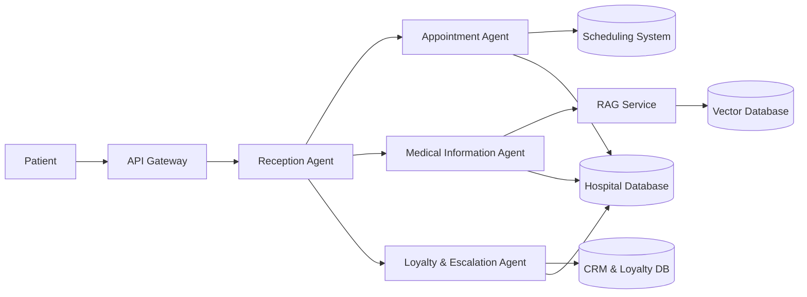

# Hospital AI Customer Service System

## Project Overview

An Agentic AI-based Hospital Customer Service Platform designed to:

- Reduce patient wait time.
- Provide 24/7 availability.
- Minimize call handling time.
- Maintain patient interaction history.
- Prioritize loyal/VIP patients.
- Automate appointment management and FAQ handling.

---

# High-Level Architecture



---

# Agent Responsibilities

## 1. Reception Agent

### Purpose
Acts as the entry point of the system.

### Responsibilities
- Identify patient intent.
- Authenticate patient.
- Route requests to the correct agent.

### Tools
- Intent Classifier
- Authentication Tool

---

## 2. Appointment Agent

### Responsibilities
- Book appointments.
- Cancel appointments.
- Reschedule appointments.

### Tools
- Scheduling API
- Calendar Service

---

## 3. Medical Information Agent

### Responsibilities
- Answer FAQs.
- Explain hospital services.
- Provide department information.

### Tools
- RAG Engine
- Knowledge Base

---

## 4. Loyalty & Escalation Agent

### Responsibilities
- Detect VIP patients.
- Assign priorities.
- Escalate critical cases.

### Tools
- CRM Database
- Priority Queue System

---

# Knowledge Base (RAG)

## Sources

- Doctors Information
- Departments Information
- Hospital Policies
- FAQs
- Insurance Details
- Appointment Procedures

## Workflow

1. User asks question.
2. Query sent to Retriever.
3. Relevant documents retrieved.
4. LLM generates answer using context.
5. Response returned to patient.

---

# File Structure

```text
hospital-ai-system/

│
├── README.md
│
├── docs/
│   ├── architecture.md
│   ├── business_requirements.md
│   ├── api_documentation.md
│   └── diagrams/
│       ├── system_flow.mmd
│       └── agent_workflow.mmd
│
├── app/
│   │
│   ├── main.py
│   │
│   ├── agents/
│   │   ├── reception_agent.py
│   │   ├── appointment_agent.py
│   │   ├── medical_agent.py
│   │   └── loyalty_agent.py
│   │
│   ├── tools/
│   │   ├── auth_tool.py
│   │   ├── scheduler_tool.py
│   │   ├── crm_tool.py
│   │   ├── rag_tool.py
│   │   └── history_tool.py
│   │
│   ├── rag/
│   │   ├── ingest.py
│   │   ├── retriever.py
│   │   ├── embeddings.py
│   │   └── vector_store.py
│   │
│   ├── database/
│   │   ├── models.py
│   │   ├── patient_repository.py
│   │   └── conversation_repository.py
│   │
│   ├── services/
│   │   ├── routing_service.py
│   │   ├── priority_service.py
│   │   └── notification_service.py
│   │
│   └── config/
│       ├── settings.py
│       └── prompts.py
│
├── knowledge_base/
│   ├── doctors/
│   ├── departments/
│   ├── policies/
│   ├── insurance/
│   └── faq/
│
├── tests/
│   ├── test_reception_agent.py
│   ├── test_appointment_agent.py
│   ├── test_medical_agent.py
│   └── test_loyalty_agent.py
│
├── requirements.txt
│
└── .env
```

---

# Suggested Tech Stack

| Layer | Technology |
|---------|------------|
| Backend | FastAPI |
| Agents | LangGraph / CrewAI |
| LLM | GPT-4o / Llama 3 |
| RAG | LangChain |
| Vector DB | ChromaDB / FAISS |
| Database | PostgreSQL |
| Authentication | JWT |
| Deployment | Docker |

---

# Future Enhancements

- Voice Agent Support
- WhatsApp Integration
- Doctor Recommendation System
- Arabic/English Multilingual Support
- Sentiment Analysis
- Emergency Case Detection
```